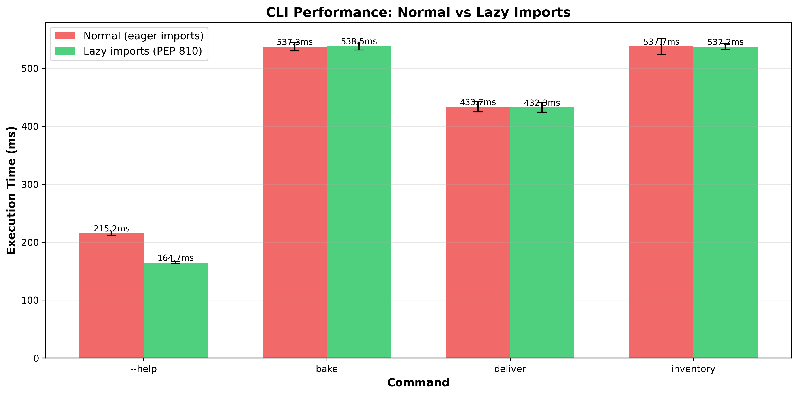
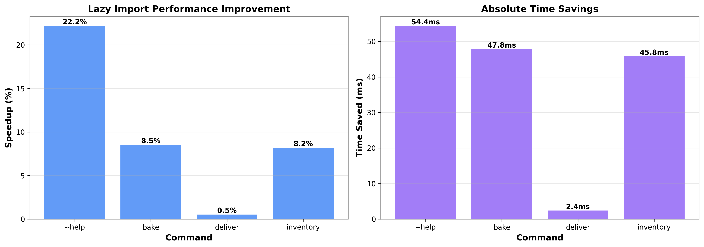

# Conference Talk notes

> ntoe: is live demo, ohh scary 👻!

### Setup (5 mins before talk)

1. Ensure Python 3.14 with PEP 810 is working
2. Run `make bench` to generate fresh results
3. Open `benchmark-results.md` for reference
4. Have two terminal windows ready:
    - Left: normal version
    - Right: lazy version
5. if all breaks during talk, unplug pc, run away

### Live Demo Flow

**0. Intro our bread ~~smuggling~~ operation business (2 min)**

**1. Show the Problem (2 min)**
```bash
# Terminal 1
time uv run breadctl --help
# Takes ~232ms, loads all modules including httpx, sqlite3, etc.
```

problem: shit is slow

**2. Explain PEP 810 (3 min)**
- Show `src/breadctl/lazy.py` with `lazy import` syntax
- Explain deferred loading behavior

very nice, but how does it work?


**3. Show the Solution (2 min)**
```bash
# Terminal 2
time uv run breadctl-lazy --help
# Takes ~179.7ms, only loads cappa/rich (29% faster!)
# TODO: click was faster, i think? need to benchmark against
```

no more problem. okay, is still a little slow but like.. **29% faster**.. not as bad right?

**4. Deep Dive (5 min)**
```bash
# Show import tree comparison
python -X importtime -c "import breadctl.normal" 2>&1 | head -20
python -X importtime -c "import breadctl.lazy" 2>&1 | head -20
```

idk if this is right way

**5. Run Hyperfine Benchmark (3 min)**
```bash
make bench
# Show visual comparison to wow audience
cat benchmark-results.md
```

Show charts from `benchmarks/`:
- `combined.png` - Full matrix with all commands
- `comparison.png` - Side-by-side comparison
- `import-comparison.png` - Pure import overhead
- `speedup.png` - Relative speedup visualization


**6. Explain When to Use (5 min)**
- CLI tools with many subcommands (litestar 😉)
- Large test suites
- Services with optional features
- Applications with plugin systems (litestar 😉)

**BONUS: Show Different CLI Frameworks (2-3 min)**
```bash
# All three frameworks work!
uv run breadctl-click --help          # Click + rich-click
uv run breadctl-cyclopts --help       # Cyclopts
uv run breadctl --help                # Cappa (default)

# Compare performance
make bench  # Shows all 6 variants
```

Key point: Lazy loading patterns vary by framework:
- **Cappa**: PEP 810 `lazy import` (cleanest, requires custom Python)
- **Click**: Inline imports in command functions (fastest lazy: 147.6ms)
- **Cyclopts**: Same as Click, inline imports

**Framework --help Performance:**
- Click-lazy: **147.6ms** (fastest overall)
- Cyclopts-lazy: 183.2ms (1.24× slower)
- Cappa-lazy: 189.1ms (1.28× slower)
- Click-normal: 190.4ms (1.29× slower)
- Cyclopts-normal: 237.7ms (1.61× slower)
- Cappa-normal: 242.9ms (1.65× slower)


**7. Caveats (2 min)**
- Import-time side effects are deferred
- Need to test for changed behavior
- Tooling support still evolving

**8. Q&A**
lol no thanks im shy and some person from an interpreter team at a quant firm will
ask me something i don't know how to answer

## Key Talking Points

### Why Lazy Imports Matter

Real benchmark results from `breadctl`:

- **CLI Tools**: `--help` is **29% faster** (232ms → 179.7ms) - lightweight commands shouldn't load heavyweight dependencies
- **Module Imports**: **30% faster** module loading (236.6ms → 182.2ms)
- **Selective Loading**: Commands like `inventory` see **~10% improvement** (576.2ms → 520.2ms) by deferring unused modules
- **Test Suites**: Faster test discovery and collection
- **Microservices**: Reduced cold-start time in serverless
- **Developer Experience**: Clearer than manual `if TYPE_CHECKING:` blocks





### CLI Framework Performance Notes

This demo includes **three CLI frameworks** to show lazy loading works universally:

**Full Command Performance (bake, deliver, inventory):**


| Command | Click-lazy | Cyclopts-lazy | Cappa-lazy | Winner |
|---------|-----------|---------------|------------|--------|
| **bake** | 392.3ms | 425.7ms | 506.5ms | Click (1.35× faster) |
| **deliver** | 407.8ms | 423.7ms | 452.3ms | Click (1.11× faster) |
| **inventory** | 395.2ms | 420.4ms | 496.5ms | Click (1.26× faster) |

**Key Insight:** Click with inline imports consistently fastest across all commands. Lazy loading effectiveness varies by framework overhead.

### PEP 810 Design Principles 

1. **Explicit**: Uses `lazy` keyword, no surprises
2. **Local**: Only affects the specific import statement
3. **Granular**: Per-import control, not global flag

### Migration Strategy

1. Profile current import time (`python -X importtime`)
2. Identify heavy/rarely-used modules
3. Apply `lazy import` selectively
4. Test for side-effect timing changes
5. Measure improvement with Hyperfine
6. CLI go brrrrr 🚀

## Resources

- [PEP 810 - Explicit Lazy Imports](https://peps.python.org/pep-0810/)
- [Python Import System](https://docs.python.org/3/reference/import.html)
- [Building CPython][building-cpython]
- [Hyperfine Benchmarking](https://github.com/sharkdp/hyperfine)

[building-cpython]: https://docs.python.org/3/reference/import.html

## Open questions

- do we want to deep dive into the pep810 implementation?
 - do i know enough about this 😵‍💫
- similar but for PyImport_ stuff
- similar but for AST building around the new `lazy` kw
