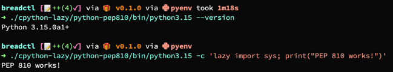
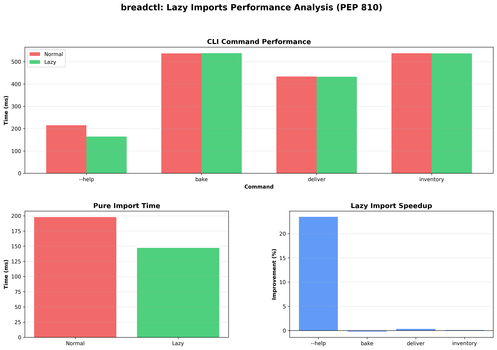
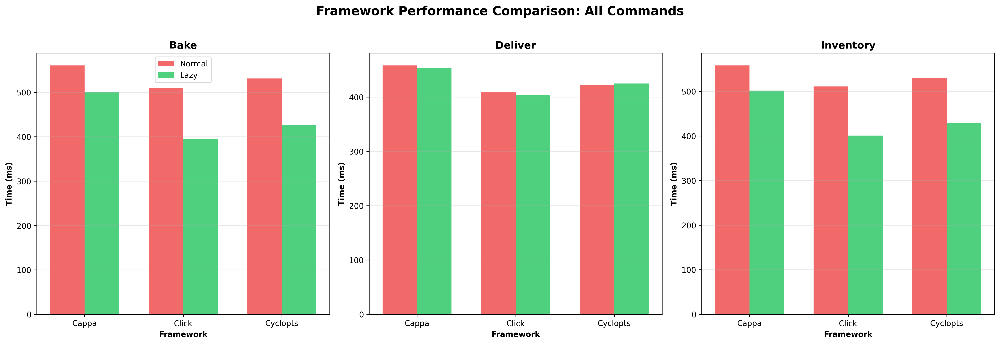
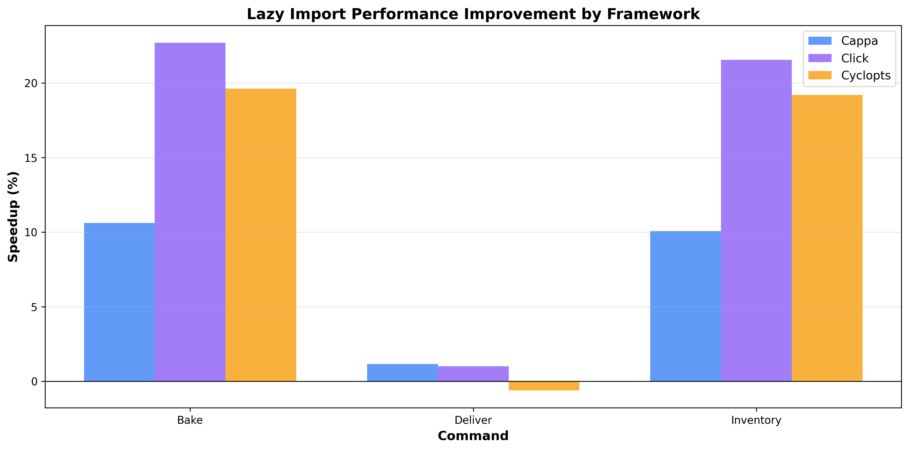

> [!WARNING]
> This is an.. insanely early.. draft.

# ALL ABOUT THE BRED

## Anthem

```markdown
my name is Cow,
and wen its nite,
or wen the moon
is shiyning brite,
and all the men
haf gon to bed –
i stay up late.
i lik the bred.
```
 - [that guy](https://yeahwrite.me/writing-help-bredlik/)

serious section begins now...

---

# breadctl - PEP 810 Lazy Imports Demo

A demonstration CLI tool showcasing [PEP 810 (Explicit Lazy Imports)](https://peps.python.org/pep-0810/) for 
conference talks and educational purposes.

### [Talk Notes](CONFERENCE.md) 

## What is PEP 810?

PEP 810 introduces explicit lazy imports to Python, allowing modules to be imported only when first accessed
rather than at import time. This can dramatically improve:

- **Startup time**: 29-30% faster in real workloads (232ms → 179.7ms for `--help`)
- **Module import time**: 30% faster module loading (236.6ms → 182.2ms)
- **Memory usage**: Unloaded modules stay unloaded until needed
- **Developer experience**: "not bad" - most developers

## Project Structure

This project demonstrates PEP 810 lazy imports across **three different CLI frameworks**:

```
breadctl/
├── src/
│   ├── breadctl-cappa/       # Cappa CLI variant (default)
│   │   ├── normal.py          # Traditional imports
│   │   ├── lazy.py            # PEP 810 lazy imports
│   │   ├── bake.py            # Heavy stdlib imports module
│   │   ├── deliver.py         # HTTP module (httpx)
│   │   └── inventory.py       # Database module (sqlite3)
│   ├── breadctl-click/        # Click + rich-click variant
│   │   ├── normal.py          # Traditional imports
│   │   ├── lazy.py            # Inline deferred imports
│   │   └── (same business logic modules)
│   └── breadctl-cyclopts/     # Cyclopts variant
│       ├── normal.py          # Traditional imports
│       ├── lazy.py            # Inline deferred imports
│       └── (same business logic modules)
├── tests/                     # Tests for all variants
└── Makefile                   # Development tasks & benchmarking
```

### CLI Framework Comparison

| Framework | Style | Lazy Loading Pattern | Rich Output |
|-----------|-------|---------------------|-------------|
| **Cappa** | Dataclass-based | PEP 810 `lazy import` | Via rich library |
| **Click** | Decorator-based | Inline `from ... import` in functions | Via rich-click |
| **Cyclopts** | Type-hint driven | Inline `from ... import` in functions | Native |

## Prerequisites

### 1. Python 3.15a0 with PEP 810 Support

⚠️ **PEP 810 was recently accepted and is not in any released Python yet.**

A reference implementation is available on GitHub:

```bash
# Clone this repo with the CPython submodule
git clone --recurse-submodules https://github.com/JacobCoffee/breadctl.git
cd breadctl

# Build custom CPython with PEP 810 support (upstream version doesnt have it yet)
cd cpython-lazy
./configure --with-pydebug --prefix=./python-pep810
make -j$(nproc)
make install

# Verify it works
./python-pep810/bin/python3.15 --version
./python-pep810/bin/python3.15 -c "lazy import sys; print('PEP 810 works!')"
```



Or clone the CPython fork directly:
```bash
git clone https://github.com/LazyImportsCabal/cpython.git -b lazy cpython-lazy
cd cpython-lazy
# Follow build steps above
```

**Note:** This is based on CPython 3.15.0alpha0 with PEP 810 support.

You can also see common build instructions (including what dependencies you need)
at [CPython's devguide](https://devguide.python.org/getting-started/setup-building/)
for more information.

#### Using the Custom Python with `uv`

Once built, point `uv` to your custom Python installation:

```bash
# Create a venv with your custom Python
uv venv --python ./cpython-lazy/python-pep810/bin/python3.15

# Or use it directly with uv run
uv run --python ./cpython-lazy/python-pep810/bin/python3.15 breadctl --help
```

See [uv's Python version docs](https://docs.astral.sh/uv/concepts/python-versions/#requesting-a-version) 
for more details on specifying custom Python installations.

### 2. Hyperfine (for benchmarking)

See [install instructions on GitHub](https://github.com/sharkdp/hyperfine#installation)

### 3. uv Package Manager

See [Astral.sh instructions](https://docs.astral.sh/uv/getting-started/installation/)

## Installation

```bash
# Clone the repo
git clone https://github.com/JacobCoffee/breadctl.git
cd breadctl

# Install dependencies with uv (using your PEP 810 Python)
make install
```

## Usage

### Cappa Variant (Default)

```bash
# Normal (eager imports)
uv run breadctl --help
uv run breadctl bake

# Lazy (PEP 810)
uv run breadctl-lazy --help
uv run breadctl-lazy bake
```

### Click Variant

```bash
# Normal (eager imports)
uv run breadctl-click --help
uv run breadctl-click deliver

# Lazy (deferred imports)
uv run breadctl-click-lazy --help
uv run breadctl-click-lazy deliver
```

### Cyclopts Variant

```bash
# Normal (eager imports)
uv run breadctl-cyclopts --help
uv run breadctl-cyclopts inventory

# Lazy (deferred imports)
uv run breadctl-cyclopts-lazy --help
uv run breadctl-cyclopts-lazy inventory
```

## Benchmarking

### Complete Benchmark Suite (Recommended)

```bash
make bench-all
```

**One-command benchmark** - Clears old results and runs full suite:
1. Cleans `benchmarks/` directory
2. Runs `bench` (framework comparison + cappa details)
3. Runs `bench-full` (all variants × all commands)
4. Runs `bench-verbose` (import time traces)
5. Generates all charts with `bench-plot`

### Individual Targets

```bash
make bench-clean   # Clear old results
make bench         # Framework comparison + cappa details → benchmark-results.md
make bench-full    # All variants × all commands → benchmark-full-matrix.md
make bench-verbose # Import time traces → benchmark-verbose.md
make bench-plot    # Generate all charts → benchmarks/*.png
```

### Example Output

#### Cappa Variant Performance

| Command                          |    Mean [ms] | Min [ms] | Max [ms] |    Relative |
|:---------------------------------|-------------:|---------:|---------:|------------:|
| `uv run breadctl --help`         |  245.1 ± 2.7 |    242.7 |    251.6 | 1.28 ± 0.03 |
| `uv run breadctl-lazy --help`    |  190.8 ± 3.8 |    188.5 |    201.2 |        1.00 |
| `uv run breadctl bake`           | 575.4 ± 17.8 |    552.7 |    601.1 | 3.02 ± 0.11 |
| `uv run breadctl-lazy bake`      | 522.6 ± 10.2 |    499.0 |    532.8 | 2.74 ± 0.08 |
| `uv run breadctl deliver`        | 458.4 ± 12.2 |    436.3 |    477.5 | 2.40 ± 0.08 |
| `uv run breadctl-lazy deliver`   |  460.8 ± 8.1 |    444.8 |    470.2 | 2.42 ± 0.06 |
| `uv run breadctl inventory`      | 603.9 ± 19.8 |    579.5 |    636.5 | 3.17 ± 0.12 |
| `uv run breadctl-lazy inventory` |  534.4 ± 8.6 |    519.3 |    545.2 | 2.80 ± 0.07 |

**Cappa Key Findings:**
- `--help`: **22% faster** with PEP 810 lazy imports (245.1ms → 190.8ms)
- `bake`: **9% faster** (575.4ms → 522.6ms)
- `inventory`: **12% faster** (603.9ms → 534.4ms)
- Pure module import: **27% faster** (228.0ms → 167.5ms)



#### Framework Comparison

**All Frameworks × All Commands:**





**--help Performance (lightweight command):**
- Click-lazy: **147.6ms** (fastest)
- Cyclopts-lazy: 183.2ms
- Cappa-lazy: 189.1ms
- Click-normal: 190.4ms
- Cyclopts-normal: 237.7ms
- Cappa-normal: 242.9ms

**Key Insight:** Click with inline imports consistently fastest. All frameworks benefit from lazy loading, but effectiveness varies by framework overhead.

## Development

### Run All Checks

```bash
make ci
```

This runs:
- `make fmt` - Format with ruff
- `make lint` - Lint with ruff
- `make ty` - Type check with ty
- `make test` - Run pytest

### Individual Tools

```bash
make lint          # Run linter
make fmt           # Format code
make ty            # Type checking with ty
make test          # Run tests
make bench         # Benchmark with hyperfine
make clean         # Clean build artifacts
```

## Resources

- [PEP 810 - Explicit Lazy Imports](https://peps.python.org/pep-0810/)
- [Python Import System](https://docs.python.org/3/reference/import.html)
- [Building CPython][building-cpython]
- [Hyperfine Benchmarking](https://github.com/sharkdp/hyperfine)

[building-cpython]: https://docs.python.org/3/reference/import.html